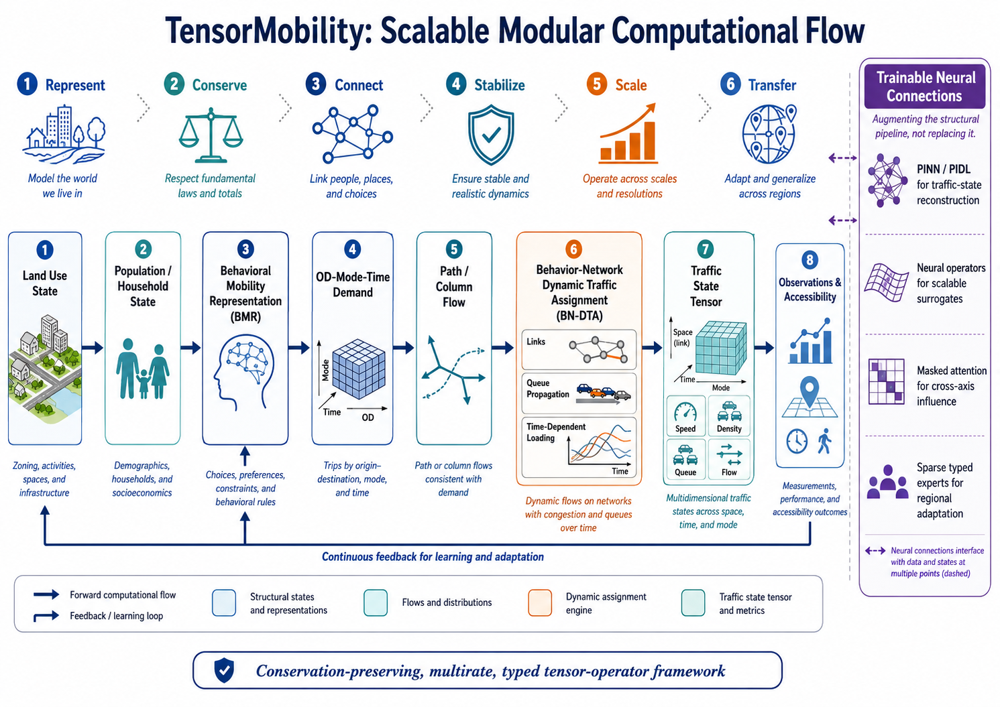
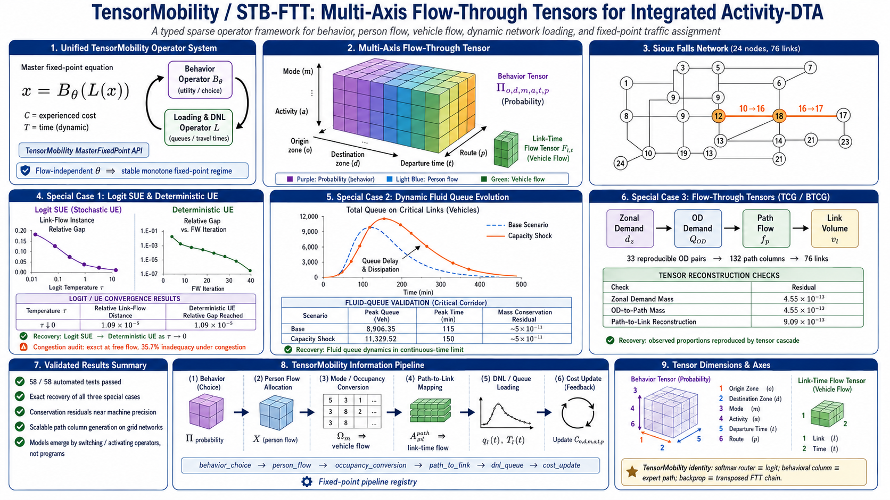

# TensorMobility

**Mobility systems as flow-through tensors — space, time, and behavior
in one certified computational graph.**

**Live interactive pages** (run in your browser, nothing to install):
**[Living GridCity](https://asu-trans-ai-lab.github.io/TensorMobility/explainer/)** ·
**[Visual Computing Studio](https://asu-trans-ai-lab.github.io/TensorMobility/explainer/studio.html)** ·
**[Tensor + ADMM Lab](https://asu-trans-ai-lab.github.io/TensorMobility/explainer/tensor-admm.html)** ·
[home](https://asu-trans-ai-lab.github.io/TensorMobility/) ·
[demo dashboard](https://asu-trans-ai-lab.github.io/TensorMobility/public_gui/demo_dashboard.html)

**Get started in three lines** (Python ≥ 3.10; not yet on PyPI):

```bash
git clone https://github.com/asu-trans-ai-lab/TensorMobility
cd TensorMobility && pip install -e ".[dev]"
python cases/run_demo_suite.py     # first success: grid 10x10 certified in ~0.2 s
```

**For practitioners:** a full regional model — 1,039,117 OD pairs,
33,963 nodes — reaches a full-network-priced equilibrium gap of
4.4e-7 in ~3.5 minutes on a single thread, GMNS files in, link-flow
CSVs + a machine-readable certificate out. A *certificate* attests
convergence, conservation, and feasibility — it is **not** calibration
or validation against counts; those remain your model's job (Chicago
Sketch link flows correlate 1.0000 with released reference volumes;
count-based validation for the regional case is planned). Current
solver coverage, honestly: BPR volume–delay (other VDFs planned),
multi-class demand as stacked OD tables (that is how the regional
sov/hov2/hov3 case runs), no turn penalties yet, CSV demand in (OMX
planned), all reported timings single-thread by protocol.

The principal contribution of TensorMobility is **not** the use of
tensor notation or of neural networks. It is a scalable mathematical
and computational architecture in which multidimensional urban states,
conservation laws, behavioral choices, network dynamics, numerical
solvers, and trainable operators are expressed and solved within one
modular operator system. The whole repository unfolds one equation:

$$
\mathcal Z^{\star}
=\Pi_{\Omega}\big[\,
\mathcal K_{\mathrm{struct}}(\mathcal Z^{\star},\mathcal U)
+\mathcal N_{\theta}(\mathcal Z^{\star},\mathcal U)\,\big]
$$

- $\mathcal Z=\{\mathcal L,\mathcal H,\mathcal A,\mathcal D,\mathcal F,\mathcal S,\mathcal Y\}$ — the multi-axis urban state (land use, households, activities, demand, path flows, network states, vehicles)
- $\mathcal K_{\mathrm{struct}}$ — the structural land-use → ABM → DTA → queue → observation operators
- $\mathcal N_{\theta}$ — the trainable components (PINN, neural operator, learned residual)
- $\Pi_{\Omega}$ — projection onto conservation, capacity, temporal, and behavioral feasibility
- $\mathcal Z^{\star}$ — the stabilized behavior–network state

Neural networks are not the starting point. Tensor decomposition is
not the starting point. ADMM is not the starting point. The starting
point is: *which states compose the urban system, and through which
conservation operators are they connected?*



## The six-layer foundation — every layer proven by a certified computational case

Doing frontier work here requires the full stack, connected — not a
neural network bolted onto an existing model. Each layer below carries
an **executable certified witness in this repository**, not a lecture
claim. Reproduce them all with `python -m pytest -q` (82 tests; 8
skip without the local-only IEEE/TRMG2 data, see the note under the
scalability table) and `python cases/run_demo_suite.py`.

| # | layer | certified witness in this repo |
|---|---|---|
| 1 | **multidimensional representation** — typed axes, contraction, sparse support | named-axis contraction ≡ Kronecker-lifted operator (tested); grouped-simplex projection to 7e-15; 597× dense-vs-sparse storage measurement |
| 2 | **conservation & physical structure** — network flow, cumulative flow, queues | chain mass conservation 1e-13; fluid-queue pulse matches closed form ≤ 7e-5; queue causality on **real detector inflow** (IEEE corridor) |
| 3 | **variational equilibrium & fixed points** — UE/SUE, VI, closure | entropy-master KKT ≡ logit (exact); τ→0 ladder to deterministic UE; mixed-autonomy closure with final-state consistency residuals |
| 4 | **numerical optimization** — FW, GP, column generation, ADMM, decomposition | full-space certified CG: Chicago 93,135 ODs @ 9.8e-5 in 12 s; **TRMG2 1,039,117 ODs @ 4.4e-7**, feasibility 1.8e-15; the engine-escalation ladder with its measured stiff-block lesson |
| 5 | **compression & scalable computation** — low rank, generated columns | rank-economy sweep (bias 2e-5 → 2.95 as K: 2 → 16; promotions sublinear); the K̄ ≈ 2.2 compression-admissibility boundary, reported honestly |
| 6 | **modern neural computation** — autodiff, adjoints, PINN, neural operators | softmax router ≡ logit (bitwise); hand adjoint ≡ autograd to 1e-9; bounded residual admissibility; the learned-proposer honest negative |

These layers must connect; learning only the last one is exactly the
failure mode this framework is designed against.

## Structure, not dimension

Classical practice writes single mappings $\mathbf y = A\mathbf x$
(OD→path, path→link, population→trips). The integrated state

$$
\mathcal X[h,n,c,r,u,o,d,m,\tau,p,a,t,\rho]
$$

(household, person, activity pattern, tour, trip leg, OD, mode,
departure interval, path, link, time, regime) is not that object with
more indices: its axes play **different mathematical roles** — some
are states, some are choices, some are fixed constraints, some are
generated by algorithms, some are observed, some must be synchronized,
some may be compressed, and some must never be silently aggregated.
What is required is a **typed multidimensional tensor**
(`STBTensor`, [docs/TENSOR_AXES.md](docs/TENSOR_AXES.md)) — not a
larger anonymous array. The type system *is* the mathematics.

## ABM → DTA is a chain of operators, not a file hand-off

$$
\mathcal A
\;\xrightarrow{\ \mathcal B\ }\;
\mathcal D
\;\xrightarrow{\ \Phi_{\mathrm{path}}\ }\;
\mathcal F
\;\xrightarrow{\ \Phi_{\mathrm{DNL}}\ }\;
\mathcal S
\;\xrightarrow{\ \Phi_{\mathrm{behavior}}\ }\;
\mathcal A^{+}
$$

Discretized, every stage is a tensor contraction
$Y_i=\sum_j K_{ij}X_j$; in continuous space, time, and behavior it is
an **integral operator**
$Y(\xi)=\int_\Omega K(\xi,\eta;\mathcal Z)\,X(\eta)\,d\eta$.
Contraction, mode products, incidence mappings, and causal time
propagation are the discrete faces of the same kernel; the fluid queue
with its closed-form pulse certificate is its continuous face. This is
precisely the seam where **neural operators** attach — and why a
learned network-loading surrogate is never free-standing:

$$
\mathcal S
=\Pi_{\Omega}\big[\,\Phi_{\mathrm{DNL}}(\mathcal D)
+r_{\theta}(\mathcal D,\mathcal Y)\,\big]
\qquad\text{never}\qquad
\mathcal S=\mathrm{NN}(\mathcal D).
$$

The DTA/DNL provides structure, the network learns what is missing,
and the projection restores feasibility. Likewise **attention is a
state-dependent transportation kernel**
$Y_i=\sum_j K_{ij}(\mathcal Z)X_j$ whose masks are not
hyperparameters: they come from network adjacency, OD–path and
path–link incidence, activity continuity, time causality, and mode /
vehicle availability. And decomposition methods (ADMM consensus,
Frank–Wolfe, column generation) belong to the **solver layer**, not
the representation layer — first the state, then the operators, then
conservation and consistency, and only then the solver.

## Reproduced and scalable — one command, one certificate

`python cases/run_demo_suite.py` reruns every key element fresh.
Every relative gap is priced over the **full network** by all-origin
shortest paths — never over the enumerated pool. Live dashboard:
**[demo dashboard](https://asu-trans-ai-lab.github.io/TensorMobility/public_gui/demo_dashboard.html)**.

| demo | nodes | links | OD pairs | columns | full-space gap | wall |
|---|--:|--:|--:|--:|--:|--:|
| grid 10×10 (self-contained) | 100 | 360 | 20 | 280 | 8.0e-5 | 0.2 s |
| grid 20×20 | 400 | 1,520 | 60 | 2,750 | 9.8e-5 | 1.8 s |
| grid 50×50 | 2,500 | 9,800 | 200 | 16,041 | 2.4e-4 | 36 s |
| IEEE TrafficFlowBench I405N | 225 | 313 | 1,058 | 1,058 | 0 (machine) | 0.05 s |
| Chicago Sketch (full) | 933 | 2,950 | 93,135 | 198,683 | 9.8e-5 | 12 s |
| **TRMG2 AM (full regional)** | 33,963 | 75,939 | **1,039,117** | 1,063,642 | **4.4e-7** | 209 s |

External-data note: the IEEE corridor and TRMG2 rows require local
datasets that are **not** in this repo — set
`TENSORMOBILITY_TFB_DATA` / `TENSORMOBILITY_TRMG2_DATA` to your
copies; without them those two demos and 8 tests skip cleanly.

The IEEE corridor is the **PINN data face**: the released path–link
incidence is reconstructed exactly (36,980 pairs), all 2,145 released
chains rebuilt into contiguous walks, the queue core runs on a real
detector episode, and fundamental-diagram priors for 65 detector
chains plus a normalized departure profile are ready for
physics-informed training
([docs/PINN_INTEGRATION.md](docs/PINN_INTEGRATION.md)).

## One operator, three readings

Every operator in the package carries a neural, an optimization, and a
transportation reading at once — as **executable identities**, not
analogies (`tensormobility.neural`; 5 of 8 rows equality-tested, 3
structural):

| neural | optimization | transportation |
|---|---|---|
| softmax router @ temp 1/θ | entropy-regularized program | **logit choice** (bitwise identical, tested) |
| MoE expert path | column of the master | behavioral chain / route |
| router score − duals | negative reduced cost | column pricing |
| deep-equilibrium layer h\*=T(h\*) | fixed point / VI | traffic equilibrium |
| backprop (transposed forward) | adjoint chain | FTT Jacobian B·A·diag(φ′)·Aᵀ·Bᵀ |
| masked-softmax stack | conserved flow chain | zone→OD→path→link |
| tanh residual head | admissible utility term | bounded behavioral calibration |
| latent atoms f = Dα | low-rank feasible coordinates | compression on spectator axes |

**The division of responsibility is fixed: neural architecture learns
the search and representation; optimization architecture enforces
feasibility and equilibrium; transportation networks provide physical
meaning and exact verification.**

## Sub-name architecture

| sub-name | import | what it owns |
|---|---|---|
| **TensorMobility.Core** | `tensormobility.core` | axis calculus (spectator / contracted / synchronized × semiring), typed sparse contracts, unified GMNS networks (grid, Sioux Falls, Chicago Sketch) |
| **TensorMobility.DTA** | `tensormobility.dta` | the DTA core: column generation, full-space-certified sparse assignment, latent atoms, classical special cases (logit SUE ↔ UE) |
| **TensorMobility.Dynamics** | `tensormobility.dynamics` | fluid point queues, path/cohort queue loading (the time seam) |
| **TensorMobility.Behavior** | `tensormobility.behavior` | **the Choice Graph** (layered DAG; chains = behavioral columns; recursive-logit face ≡ column face, tested), activity chains, bounded learning residuals |
| **TensorMobility.Engines** | `tensormobility.engines` | the equilibrium engine escalation ladder (Picard → MSA → Anderson → stiff-block Newton; NCP/VI declared) with cycle detection |
| **TensorMobility.Profiles** | `tensormobility.profiles` | layered equilibria: passenger–vehicle coupling `Rx ≤ Sy`, mixed-autonomy ride-hailing (MAGE) |
| **TensorMobility.Adapters** | `tensormobility.adapters` | external data faces: IEEE TrafficFlowBench corridors, TRMG2 regional model (GMNS in, certificates out) |
| **TensorMobility.Harness** | `tensormobility.harness` | experiment harnesses, analytical anchors, well-posedness maps |

Future sub-names slot in without touching the canon (the axis registry
extends, never mutates): `TensorMobility.Phase`,
`TensorMobility.Transit`, `TensorMobility.Freight`.

## Quickstart

```python
from tensormobility import load_case, network_from_case, solve_fw

case = load_case('chicago_sketch')          # 933 nodes, 93,135 ODs, GMNS
result = solve_fw(network_from_case(case))  # full-space certified gap
print(result.relative_gap)                  # ~1e-4 in ~12 s
```

```bash
python -m pytest -q                  # 82 tests (8 skip without local data)
python cases/run_demo_suite.py       # the four-scale demonstration above
python cases/run_rank_economy.py     # the compression-economy measurement
python cases/run_mage_grid.py        # mixed-autonomy equilibrium + sweeps
```

## Workflows & GUI

Seven named workflows compose every use of the package
([workflow.yml](workflow.yml) is the machine-readable source of
truth). Rendered pages (gui4gmns-style, self-contained):

- **[Visual Computing Studio](https://asu-trans-ai-lab.github.io/TensorMobility/explainer/studio.html)** — nine chapters of tensor visual grammar (spec v2): coordinate/fiber/slice, lossless unfold/fold, mode product, a contraction studio with predict-first pedagogy, the typed block-flow graph, a **live Jacobi-SVD representation lab** (the canonical demand tensor is exactly rank 3), sparse support with its conservation warning, the ADMM consensus studio, and a real masked-attention bridge with its non-equivalences stated
- **[Tensor + ADMM Lab](https://asu-trans-ai-lab.github.io/TensorMobility/explainer/tensor-admm.html)** — one typed coordinate, a spatial-only translation (4 cells → 2 zones, hand-checkable), conservation you can break and diagnose, the null-space information-loss lesson, and step-by-step ADMM consensus across ABM/demand/DTA with residuals and a ρ slider
- **[The Explainer — a living GridCity](https://asu-trans-ai-lab.github.io/TensorMobility/explainer/)** — the whole pipeline (land use → gravity demand → column generation + MSA with full-space Dijkstra pricing) solved live in the browser with the real certificate; hover a zone for its desire lines, click a road for its live BPR math and the OD pairs using it, scrub iterations, presets. Plus five focused [concept cards](https://asu-trans-ai-lab.github.io/TensorMobility/) on the home page. Format inspired by the [Polo Club](https://poloclub.github.io/) explainer family ([CNN Explainer](https://poloclub.github.io/cnn-explainer/), [Transformer Explainer](https://poloclub.github.io/transformer-explainer/)); our design rules in [docs/EXPLAINER_DESIGN.md](docs/EXPLAINER_DESIGN.md)
- **[Workflow map](https://asu-trans-ai-lab.github.io/TensorMobility/public_gui/workflow.html)** — W1 generate · W2 assign · W3 import · W4 calibrate · W5 visualize · W6 teach · W7 profile
- **[Demo dashboard](https://asu-trans-ai-lab.github.io/TensorMobility/public_gui/demo_dashboard.html)** — the fresh certified scalability run
- Pipelines: quickstart W1→W2→W5 · MPO W1→W3→W5 · corridor W1→W3→W4→W5 · research W1→W7→W5 · classroom W6
- Ecosystem contract with TAPLite4MPO / DTALite / gui4gmns / dynamic-odme-lab: GMNS folders are the only inter-tool interface; `certificates.json` rides beside every output ([docs/ECOSYSTEM_DESIGN.md](docs/ECOSYSTEM_DESIGN.md))

## Teaching

`teaching/` carries the T1–T7 ladder (FTT chain by hand → logit/UE →
fluid queues → pool audit → compression boundary → prices as
synchronization → mixed autonomy + engines). See
[teaching/README.md](teaching/README.md).

## Papers & docs

- `research_papers/main_v06.tex` — the framework wrap-up draft.
- [docs/ENGINES.md](docs/ENGINES.md) — the solver escalation ladder position paper.
- [docs/PINN_INTEGRATION.md](docs/PINN_INTEGRATION.md) — how physics-informed learning attaches to the structural operators.
- [docs/ECOSYSTEM_DESIGN.md](docs/ECOSYSTEM_DESIGN.md) — the GMNS ecosystem contract.



Naming note: **TensorMobility** is the software; **STB-FTT /
Flow-Through Tensors** is the framework name used in the papers. Both
names appear here so each finds the other.
